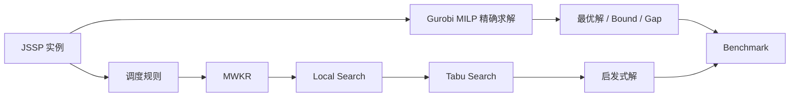
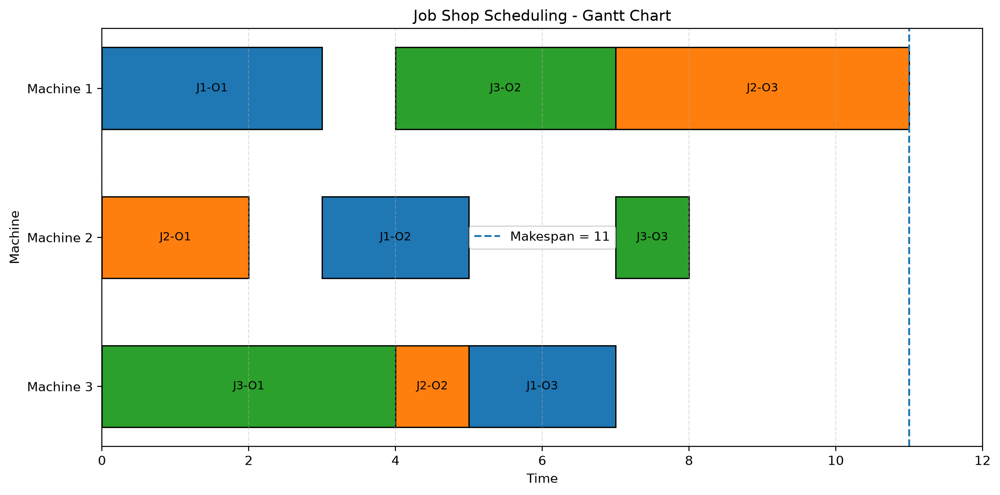
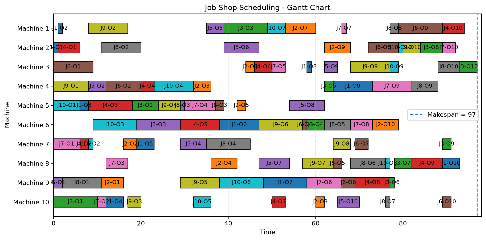

<div align="center">

# Job Shop Scheduling 优化算法项目

### 作业车间调度：精确求解、启发式算法、局部搜索与禁忌搜索

**Python · Gurobi · 组合优化 · 调度优化 · Metaheuristic**

</div>

---

## 项目简介

本项目围绕经典的 **作业车间调度问题（Job Shop Scheduling Problem, JSSP）**，从数学建模出发，逐步实现精确算法与启发式算法，并通过随机实例、运行时间实验和最优性 Gap 对不同方法进行系统比较。

整个项目按照以下路线逐步展开：



目前已经实现：

- Gurobi MILP 精确模型
- 随机 JSSP 实例生成器
- 自动可行性验证器
- Gantt Chart 调度可视化
- SPT / LPT / MWKR 调度规则
- Adjacent-Swap Local Search
- Tabu Search
- Gurobi Incumbent / Best Bound / MIP Gap 分析
- 多规模 Runtime Benchmark
- 启发式算法 Gap 对比
- Local Search 改进实验
- Tabu Search 多实例实验
- Tabu 参数敏感性分析

---

# 1. 问题定义

给定：

- 若干个 Job；
- 若干台 Machine；
- 每个 Job 包含若干按固定顺序执行的 Operation；
- 每个 Operation 指定一台机器及一个加工时间。

需要满足两个基本条件：

**工序优先关系**

同一个 Job 的后一道工序必须等待前一道工序完成。

**机器容量约束**

同一台机器在同一时刻只能加工一道工序。

优化目标是：

> 在满足所有工序顺序和机器冲突约束的情况下，使所有 Job 尽可能早地全部完成。

这一最终完成时间称为：

$C_{\max}$，即 **Makespan**。

因此目标为：

`minimize Cmax`

---

# 2. MILP 数学模型

对于 Job $i$ 的第 $j$ 道工序，定义开始时间：

$S_{ij}$

加工时间为：

$p_{ij}$

## Job precedence

同一个 Job 的工序必须按照给定顺序执行：

$S_{i,j+1} \ge S_{ij}+p_{ij}$

## Machine non-overlap

如果工序 $A$ 和 $B$ 使用同一台机器，引入二元变量 $y$ 决定二者顺序：

$S_B \ge S_A+p_A-M(1-y)$

$S_A \ge S_B+p_B-My$

其中：

$y\in\{0,1\}$

## Makespan

$C_{\max}$ 不得小于任意 Job 最后一道工序的完成时间。

最终目标：

`min Cmax`

完整模型实现于：

```text
gurobi_solver.py
```

---

# 3. 项目结构

```text
job-shop-scheduling/
│
├── main.py
├── instance.py
├── random_instance.py
│
├── gurobi_solver.py
├── validator.py
├── gantt_chart.py
│
├── heuristic_solver.py
├── local_search.py
├── tabu_search.py
│
├── test_random.py
├── test_heuristic.py
├── compare_heuristics.py
├── test_local_search.py
├── test_tabu_search.py
│
├── experiments.py
├── convergence_experiment.py
├── heuristic_benchmark.py
├── local_search_benchmark.py
├── tabu_benchmark.py
├── tabu_parameter_experiment.py
│
├── plot_results.py
├── plot_convergence.py
├── plot_heuristic_results.py
├── plot_local_search_results.py
│
├── requirements.txt
├── README.md
└── .gitignore
```

| 文件 | 功能 |
| --- | --- |
| `random_instance.py` | 生成可复现的随机 JSSP 实例 |
| `gurobi_solver.py` | 建立并求解 MILP 精确模型 |
| `heuristic_solver.py` | 实现 SPT、LPT、MWKR |
| `local_search.py` | Adjacent-Swap Local Search |
| `tabu_search.py` | Tabu Search 元启发式 |
| `validator.py` | 自动检查调度可行性 |
| `gantt_chart.py` | 生成 Gantt Chart |
| `experiments.py` | Gurobi 规模实验 |
| `heuristic_benchmark.py` | 调度规则 Benchmark |
| `local_search_benchmark.py` | Local Search Benchmark |
| `tabu_benchmark.py` | Local Search 与 Tabu 对比 |
| `tabu_parameter_experiment.py` | Tabu 参数敏感性分析 |

---

# 4. 自动验证

程序求出一个调度并不代表它一定正确。

因此项目独立实现了三类 Validator。

### Job Precedence

检查同一个 Job 的工序是否满足先后顺序。

### Machine Non-overlap

检查同一台机器上的任意两道工序是否发生时间重叠。

### Makespan

重新计算所有工序完成时间，并检查程序返回的 $C_{\max}$ 是否正确。

正常结果：

```text
Job precedence:       PASS
Machine non-overlap:  PASS
Makespan:             PASS

Overall validation:   PASS
```

同一套 Validator 可以验证：

```text
Gurobi
SPT / LPT / MWKR
Local Search
Tabu Search
```

产生的调度。

---

# 5. Gantt Chart 可视化

调度结果可以转换为按机器排列的 Gantt Chart：



通过图形可以直接观察：

- 每台机器的加工顺序；
- Machine Idle Time；
- Job Waiting Time；
- 是否存在机器冲突；
- 最终 Makespan。

---

# 6. Gurobi 精确求解实验

首先研究问题规模增加对精确 MILP 求解的影响。

对多个随机实例进行测试后，得到：

| Problem Size | Median Runtime |
| --- | ---: |
| 3 × 3 | 0.0014 s |
| 5 × 5 | 0.0048 s |
| 7 × 7 | 0.0621 s |
| 10 × 10 | 1.0421 s |

可以观察到：

> 随着 JSSP 规模增加，Gurobi 求解时间开始快速增加。

同时，相同规模的实例难度也可能存在很大差异。

在 $12\times12$ 实验中，不同 seed 的求解时间从约 2 秒到超过 30 秒不等，其中一个实例达到：

```text
TIME_LIMIT = 30 s
```

但这并不意味着没有找到可行解，而是：

> Gurobi 在规定时间内没有完成全局最优性的证明。

---

# 7. Incumbent、Best Bound 与 MIP Gap

对于最小化问题：

`Best Bound <= Optimal Value <= Incumbent`

其中：

**Incumbent**

当前已经找到的最好可行解。

**Best Bound**

Gurobi 当前能够证明的最优值下界。

**MIP Gap**

衡量当前可行解和理论 Bound 之间还有多大距离。

项目对同一个困难实例分别设置：

```text
1 s
5 s
10 s
30 s
```

的求解时间，用于观察：

```text
Upper Bound ↓
Lower Bound ↑
MIP Gap     ↓
```

这说明：

> “找到一个好解”和“证明这个解已经最优”是两个不同的问题。

---

# 8. 三种 Dispatching Rules

为了在极短时间内构造可行调度，实现了三种经典规则。

## SPT

**Shortest Processing Time**

优先安排当前加工时间较短的工序。

## LPT

**Longest Processing Time**

优先安排当前加工时间较长的工序。

## MWKR

**Most Work Remaining**

优先安排剩余总加工量较大的 Job。

三种方法均建立在 Earliest-Start List Scheduling 框架上。

---

# 9. Dispatching Rule Benchmark

对：

```text
5 × 5
7 × 7
10 × 10
```

三个规模分别生成 20 个随机实例。

比较三种 Heuristic 与 Gurobi 最优解之间的 Gap。

## Mean Gap to Optimal

| Size | SPT | LPT | MWKR |
| --- | ---: | ---: | ---: |
| 5 × 5 | 13.33% | 21.33% | **9.63%** |
| 7 × 7 | 16.05% | 29.18% | **10.93%** |
| 10 × 10 | 22.32% | 30.78% | **15.61%** |

在当前随机实例集上：

\[
\boxed{\text{MWKR} \;>\; \text{SPT} \;>\; \text{LPT}}
\]

这里的“>”表示整体实验表现更好。

## Best-or-Tied Count

| Size | SPT | LPT | MWKR |
| --- | ---: | ---: | ---: |
| 5 × 5 | 9 / 20 | 3 / 20 | **12 / 20** |
| 7 × 7 | 7 / 20 | 1 / 20 | **15 / 20** |
| 10 × 10 | 5 / 20 | 0 / 20 | **15 / 20** |

因此后续算法选择：

```text
MWKR
```

作为初始解构造方法。

---

# 10. Local Search

在 MWKR 调度基础上实现：

**Adjacent-Swap Local Search**

基本思想：

```text
MWKR Initial Schedule
        ↓
提取每台机器的加工顺序
        ↓
交换两个相邻 Operation
        ↓
重新进行 DAG Decode
        ↓
检查是否形成 Cycle
        ↓
计算新的 Makespan
        ↓
只接受严格改善的邻居
```

给定固定机器顺序后，通过 Job precedence 和 Machine sequence 构造有向图，并利用拓扑排序计算 Earliest Start Schedule。

如果图中产生 Directed Cycle，则该邻居不可行。

---

# 11. Local Search 实验

20 个随机实例上的结果：

| Size | Improved | MWKR Gap | Local Search Gap |
| --- | ---: | ---: | ---: |
| 5 × 5 | 5 / 20 | 9.63% | **8.36%** |
| 7 × 7 | 8 / 20 | 10.93% | **9.01%** |
| 10 × 10 | 14 / 20 | 15.61% | **13.09%** |

随着问题规模增加，Local Search 能够改善 MWKR 的实例比例为：

```text
25% -> 40% -> 70%
```

对于 $10\times10$：

```text
MWKR Median Runtime       ≈ 0.64 ms
Local Search Median Time  ≈ 17.76 ms
```

因此 Local Search 以增加少量计算时间为代价，获得了更高质量的调度。

---

# 12. 为什么 Local Search 会卡住？

Local Search 只接受：

`new makespan < current makespan`

如果当前所有邻居都满足：

`new makespan >= current makespan`

算法便停止。

但这只代表：

\[
\boxed{\text{Local Optimum}}
\]

并不代表：

\[
\boxed{\text{Global Optimum}}
\]

更好的区域可能需要经历：

```text
99 -> 99 -> 99 -> 97
```

甚至：

```text
99 -> 101 -> 96
```

而严格改善型 Local Search 无法完成这些移动。

因此进一步引入：

\[
\boxed{\text{Tabu Search}}
\]

---

# 13. Tabu Search

Tabu Search 在 Local Search 的基础上加入：

- Short-term Memory；
- Tabu List；
- Tabu Tenure；
- Aspiration Criterion；
- Best-so-far Solution。

算法允许搜索：

- 等值邻居；
- 某些非改善邻居；

同时通过 Tabu List 避免短期内来回交换。

算法结构：

```text
Local Search Solution
        ↓
Adjacent-Swap Neighborhood
        ↓
过滤 Tabu Move
        ↓
Aspiration Check
        ↓
选择允许的最佳 Neighbor
        ↓
更新 Current Solution
        ↓
更新 Best-so-far
```

---

# 14. 一个典型实例

在一个 $10\times10$ 随机实例中：

| Method | Makespan | Gap |
| --- | ---: | ---: |
| MWKR | 103 | 17.05% |
| MWKR + Local Search | 99 | 12.50% |
| MWKR + Tabu Search | 97 | 10.23% |
| Gurobi Optimal | **88** | 0% |

算法演进：

```text
MWKR
103
 ↓
Local Search
99
 ↓
Tabu Search
97
 ↓
Gurobi Optimal
88
```

值得注意的是：

> Tabu Search 是直接从 Local Search 的局部最优解 99 出发，再继续找到 97。

因此说明 Tabu Search 确实能够突破严格改善型 Local Search 的搜索限制。



---

# 15. Tabu Search 多实例 Benchmark

在 20 个 $10\times10$ 随机实例上：

## Mean Gap

| Method | Mean Gap |
| --- | ---: |
| MWKR | 15.61% |
| MWKR + Local Search | 13.09% |
| MWKR + Tabu Search | **11.00%** |

## Median Gap

| Method | Median Gap |
| --- | ---: |
| MWKR | 15.39% |
| MWKR + Local Search | 13.06% |
| MWKR + Tabu Search | **10.54%** |

Tabu Search 相比 Local Search：

```text
严格改善：12 / 20
保持相同： 8 / 20
变差：     0 / 20
```

平均相比 Local Search 进一步改善：

```text
1.81%
```

所有调度均通过：

```text
Job precedence
Machine non-overlap
Makespan
```

验证。

---

# 16. Quality–Runtime Trade-off

同一批 $10\times10$ 实例的 Median Runtime：

| Algorithm | Median Runtime |
| --- | ---: |
| Local Search | 17.93 ms |
| Tabu Search | 867.02 ms |
| Gurobi | 1015.56 ms |

这揭示了一个重要事实：

> 解的质量提高往往需要支付额外的计算成本。

当前 Python Tabu Search 的求解质量优于 Local Search，但在中等规模实例上，其运行时间已经接近 Gurobi。

因此本项目不将结果解释为：

> Tabu Search 优于 Gurobi。

更准确的结论是：

> Tabu Search 能够进一步改善快速构造出的启发式解，但当前实现仍存在较大的计算效率优化空间。

---

# 17. Tabu 参数敏感性实验

进一步研究两个参数：

```text
Tabu Tenure
Maximum Iterations
```

测试：

```text
Tenure     = 3, 7, 12
Iterations = 25, 50, 100
```

部分实验结果：

| Tenure | Iterations | Mean Gap | Median Gap | Runtime |
| ---: | ---: | ---: | ---: | ---: |
| 3 | 25 | 12.42% | 13.33% | 215.88 ms |
| 3 | 50 | 12.42% | 13.33% | 433.38 ms |
| 7 | 25 | 12.19% | 13.33% | 216.90 ms |
| 7 | 100 | 11.32% | 10.10% | 870.54 ms |
| 12 | 25 | 11.54% | 11.21% | 217.20 ms |
| 12 | 50 | **11.01%** | **10.33%** | 441.32 ms |
| 12 | 100 | **10.43%** | **9.81%** | 868.24 ms |

最高解质量出现在：

```text
tabu tenure = 12
iterations  = 100
```

但从 50 次增加到 100 次：

```text
Mean Gap:
11.01% -> 10.43%

Runtime:
441 ms -> 868 ms
```

计算时间接近翻倍，但 Gap 只进一步下降 0.58 个百分点。

因此项目默认采用：

```text
tabu tenure = 12
iterations  = 50
```

作为解质量和运行时间之间的折中。

---

# 18. 算法演进主线

整个项目并不是一次性直接写 Tabu Search，而是按照问题驱动逐步发展：

```text
JSSP
 ↓
MILP
 ↓
Gurobi Exact Solver
 ↓
随机实例 Benchmark
 ↓
SPT / LPT / MWKR
 ↓
MWKR 表现最好
 ↓
Adjacent-Swap Local Search
 ↓
Local Optimum / Plateau
 ↓
Tabu Search
 ↓
Parameter Sensitivity
 ↓
Quality–Runtime Trade-off
```

这形成了完整的：

\[
\boxed{
\text{Exact Optimization}
+
\text{Construction Heuristic}
+
\text{Improvement Heuristic}
+
\text{Metaheuristic}
}
\]

算法体系。

---

# 19. 当前实验结论

目前实验支持以下阶段性结论：

1. Gurobi MILP 能够在小型和部分中型 JSSP 上稳定获得并证明全局最优解。
2. 相同问题规模的随机实例，其求解难度可能存在显著差异。
3. 在测试的三种简单 Dispatching Rule 中，MWKR 总体表现最好。
4. Adjacent-Swap Local Search 能够进一步降低 MWKR 的 Makespan。
5. Local Search 改善率随着测试规模增大而提高。
6. Tabu Search 可以从 Local Search 的局部最优解继续搜索。
7. 在 20 个 $10\times10$ 实例上，Tabu Search 将平均 Gap 从 13.09% 降至 11.00%。
8. Tabu Search 获得更好解的同时增加了明显的计算成本。
9. Tabu 参数增加能够继续改善解质量，但存在明显的边际收益递减。

---

# 20. 快速运行

安装依赖：

```bash
python3 -m pip install -r requirements.txt
```

运行基础 MILP：

```bash
python3 main.py
```

运行随机实例：

```bash
python3 test_random.py
```

比较 SPT / LPT / MWKR：

```bash
python3 compare_heuristics.py
```

运行 Heuristic Benchmark：

```bash
python3 heuristic_benchmark.py
```

运行 Local Search：

```bash
python3 test_local_search.py
```

运行 Local Search Benchmark：

```bash
python3 local_search_benchmark.py
```

运行 Tabu Search：

```bash
python3 test_tabu_search.py
```

运行 Tabu Benchmark：

```bash
python3 tabu_benchmark.py
```

运行 Tabu 参数实验：

```bash
python3 tabu_parameter_experiment.py
```

---

# 21. 当前局限

本项目当前主要用于算法学习、工程实现和计算实验，仍存在以下局限：

- 目前主要使用随机生成实例；
- 尚未系统使用经典 JSSP Benchmark；
- Local Search 仅采用 Adjacent Swap；
- 尚未使用 Critical Block Neighborhood；
- 每个 Neighbor 都重新执行 DAG Decode；
- 尚未实现增量 Makespan 更新；
- Tabu Tenure 仍为固定值；
- 尚未加入 Diversification / Restart；
- 实验规模受到当前 Gurobi License 限制；
- Python 实现仍有较大性能优化空间。

---

# 22. 后续扩展

后续可以继续研究：

- FT / LA / OR-Library 标准 JSSP Benchmark；
- Critical Path；
- Critical Block Neighborhood；
- N5 / N6 等经典 JSSP Neighborhood；
- Adaptive Tabu Tenure；
- Diversification；
- Restart；
- Variable Neighborhood Search；
- Simulated Annealing；
- CP-SAT；
- OR-Tools；
- 更高效的数据结构；
- 增量式邻域评价；
- 大规模算法 Benchmark。

---

# 23. 项目能力覆盖

本项目覆盖完整的优化算法工程流程：

```text
问题建模
   ↓
MILP
   ↓
Exact Solver
   ↓
自动验证
   ↓
随机实例
   ↓
Benchmark
   ↓
Construction Heuristic
   ↓
Local Search
   ↓
Metaheuristic
   ↓
参数实验
   ↓
结果分析
```

涉及的主要技术：

```text
Python
Gurobi
Mixed Integer Programming
Job Shop Scheduling
Combinatorial Optimization
Graph / DAG
Topological Sort
Dispatching Rules
Local Search
Tabu Search
Benchmark
Experimental Analysis
Git / GitHub
```

---

<div align="center">

### 从数学模型到精确求解，再到启发式与元启发式

**建模 · 求解 · 验证 · 改进 · 实验**

</div>